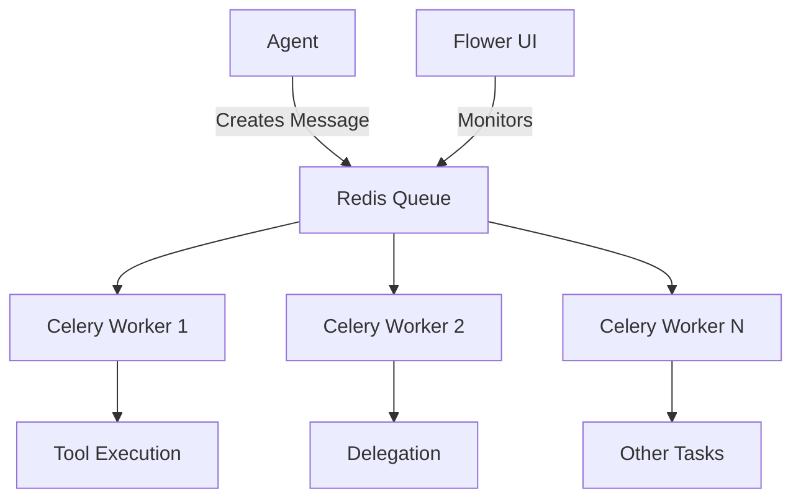

# Async Execution

Gnosari AI Teams supports asynchronous job processing through a powerful queue system built on **Celery** with **Redis** as the message broker. This enables agents to execute tools and delegate tasks asynchronously, allowing for better scalability, background processing, and non-blocking operations. Teams can run completely in the background, processing complex workflows without blocking user interactions.

:::info Human-in-the-Loop
Human-in-the-loop capabilities are currently being implemented to allow teams to escalate tasks to human operators when needed, enabling seamless collaboration between AI agents and human experts.
:::

## Overview

The queue system provides several key capabilities:

- 🔄 **Async Tool Execution**: Any built-in tool can be executed asynchronously
- 🤝 **Async Delegation**: Agents can delegate tasks to other agents without blocking
- ⚡ **Scalable Processing**: Multiple workers can process jobs concurrently
- 🌐 **Background Execution**: Teams can run in the background without blocking user interactions
- 👥 **Human Escalation**: Escalate complex tasks to human operators when needed
- 📊 **Monitoring**: Built-in monitoring with Flower UI
- 🛠️ **Worker Management**: Start, stop, and monitor workers via CLI

## Architecture



## Key Components

### Messages
- **BaseMessage**: Foundation for all queue messages with validation
- **ToolExecutionMessage**: Executes any built-in tool asynchronously
- **Custom Messages**: Extend BaseMessage for specific use cases

### Consumers
- **BaseConsumer**: Abstract base for all message processors
- **ToolExecutionConsumer**: Generic consumer for tool execution
- **Custom Consumers**: Process specific message types

### Configuration
- **CeleryConfig**: Centralized Celery configuration with best practices
- **Environment Variables**: Redis broker and result backend configuration
- **Queue Names**: Configurable queue routing for different task types

## Background Team Execution

Teams can be executed completely in the background, allowing for:

- **Long-Running Workflows**: Process complex multi-step tasks without timeouts
- **Non-Blocking Operations**: Users can continue working while teams process in background
- **Scalable Processing**: Multiple teams can run simultaneously across different workers
- **Resource Management**: Background execution prevents resource conflicts

### Running Teams in Background

```bash
# Execute team in background mode
gnosari --config "team.yaml" --message "Process large dataset" --background

# Check background job status
gnosari job status <job-id>

# Monitor background execution
gnosari flower
```

### Background Team Configuration

```yaml
name: Background Processing Team
config:
  execution_mode: background  # Enable background execution
  timeout: 3600  # 1 hour timeout for long-running tasks

agents:
  - name: DataProcessor
    instructions: "Process large datasets in background"
    tools:
      - mysql_query
      - file_operations
```

## Getting Started

1. **Start Redis** (via docker-compose):
   ```bash
   docker-compose up redis -d
   ```

2. **Start Workers**:
   ```bash
   gnosari worker start
   ```

3. **Monitor with Flower**:
   ```bash
   gnosari flower
   # Visit http://localhost:5555
   ```

4. **Configure Async Tools** in your team YAML:
   ```yaml
   tools:
     - name: "file_ops"
       module: "gnosari.tools.builtin.file_operations"
       class: "FileOperationsTool"
       mode: async  # Enable async execution
   ```

## Next Steps

- [Async Configuration](./async-configuration): Learn how to configure async mode for tools and delegation
- [CLI Commands](./cli-commands): Master the worker management commands
- [Worker Management](./worker-management): Advanced worker configuration and monitoring